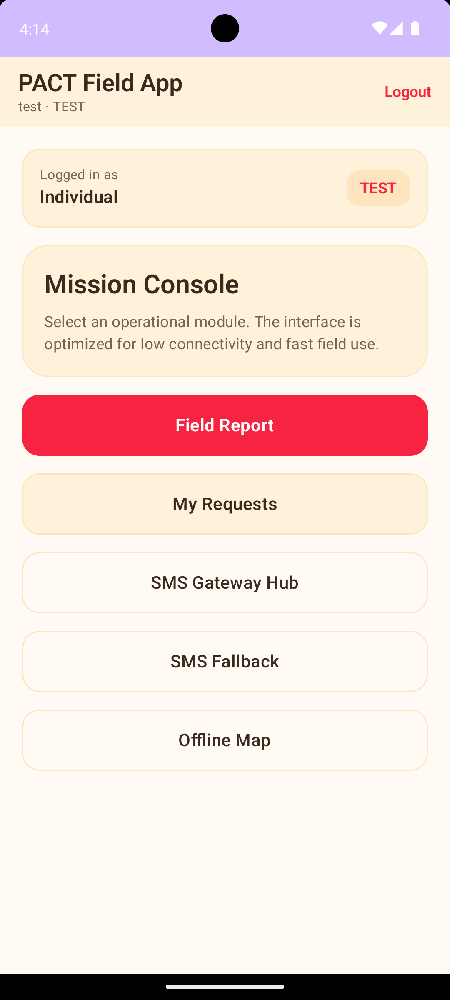
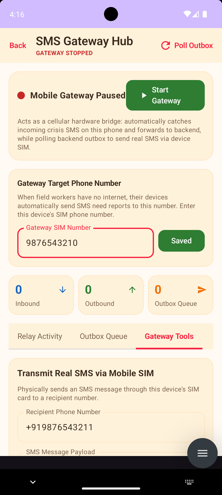
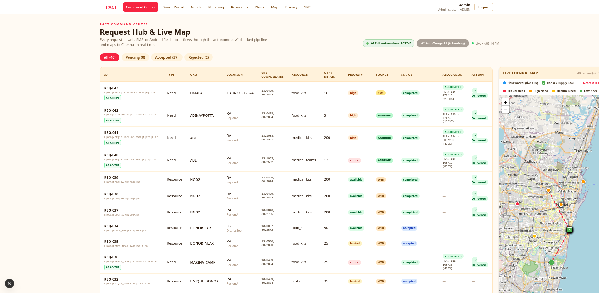

# PACT

**A comprehensive humanitarian field app and coordination platform.**

PACT provides a unified system for field workers, administrators, and donors to manage resource requests, field reports, and coordination efforts in low-connectivity environments. The platform consists of a native Android application with SMS fallback capabilities, a Python backend API, and a Next.js web dashboard for high-level coordination and donor management.

## Features

### Android Field App
- **Offline-First Architecture:** Local database storage and offline queueing for requests and reports when network connectivity is unavailable.
- **SMS Fallback Gateway:** Encodes and decodes data over standard SMS for critical communications when cellular data is completely unavailable.
- **Field Reporting:** Submit and track field reports, status updates, and organizational requests directly from the field.
- **Offline Maps:** View and plot map markers without an active internet connection.
- **Admin Controls:** Dedicated interface for managing the SMS gateway and monitoring sync states.

### Web Dashboard
- **Coordination Hub:** Manage resource needs, response plans, and request matching across multiple field units.
- **Donor Portal:** Dedicated views for donors to track resource allocation and impact.
- **SMS Agent Logs:** Monitor and manage the SMS fallback gateway remotely.
- **Geospatial Visualization:** Interactive mapping to visualize request density and resource distribution.

### Backend API
- **Centralized Data Store:** Handles synchronization between the Android field app and the web dashboard.
- **RESTful Endpoints:** Secure API for managing users, requests, plans, and field reports.

## Tech Stack

| Component | Technologies |
|---|---|
| **Android App** | Kotlin, Jetpack Compose, Room (Local Storage), Coroutines |
| **Web Dashboard** | Next.js (App Router), TypeScript, React, Tailwind CSS |
| **Backend API** | Python, FastAPI/Flask, Relational Database |
| **Build Tools** | Gradle (Android), npm/yarn (Web) |

## Architecture

The system follows a three-tier architecture:

1. **Field Tier (Android):** Operates in disconnected environments using local Room databases and an `OfflineQueue`. When internet is unavailable, the `SmsGatewayManager` compresses and encodes payloads into SMS messages.
2. **API Tier (Backend):** Acts as the source of truth, processing standard HTTP requests from the web dashboard and syncing batched offline data from the Android app when connectivity resumes.
3. **Management Tier (Web):** Provides administrators and donors with real-time dashboards to view incoming field reports, approve resource requests, and monitor the SMS gateway status.

## Project Structure

```text
PACT/
├── android/                # Native Android field application
│   └── app/src/main/java/org/humanitarian/fieldapp/
│       ├── models/         # Data classes (FieldReport, OrgRequest, MapMarker)
│       ├── network/        # API client and network utilities
│       ├── offline/        # LocalRequestStore, OfflineQueue, SyncManager
│       ├── sms/            # SMS Encoder/Decoder, GatewayManager, BroadcastReceivers
│       ├── sync/           # Background synchronization workers
│       └── ui/             # Jetpack Compose screens (Home, Login, FieldReport, Maps)
├── backend/                # Python API server
│   ├── app/
│   │   ├── main.py         # API routes and application logic
│   │   └── db.py           # Database models and connection logic
│   └── requirements.txt    # Python dependencies
├── web/                    # Next.js web dashboard
│   ├── app/                # Next.js App Router pages (donor, matching, needs, requests, sms)
│   ├── components/         # React components (Map, RequestTable, Badges)
│   └── lib/                # API clients, auth logic, and TypeScript types
└── .gitignore
```

## Getting Started

### Prerequisites
- **Android:** Android Studio, JDK 11+, Android SDK
- **Backend:** Python 3.9+
- **Web:** Node.js 18+

### Running the Backend
```bash
cd backend
pip install -r requirements.txt
uvicorn app.main:app --reload --host 0.0.0.0 --port 8000
 # Server typically runs on http://localhost:8000
```

### Running the Android App
1. Open the `android/` directory in Android Studio.
2. Sync Gradle files.
3. Run the `app` module on an emulator or physical device.

*Note: Ensure the API base URL in `network/ApiClient.kt` points to your running backend.*

### Running the Web Dashboard
```bash
cd web
npm install
npm run dev
# Dashboard typically runs on http://localhost:3000
```

## Screenshots

To add screenshots of the application interfaces to this README, create a `docs/screenshots/` directory in the root of the repository and place your images there.

**Example directory structure:**
```text
docs/
└── screenshots/
    ├── android-home.png
    ├── android-sms-gateway.png
    ├── web-dashboard.png
    └── web-map.png
```

**App Interfaces:**

<p align="center">
  
  
  
  
</p>
<p align="center">

</p>